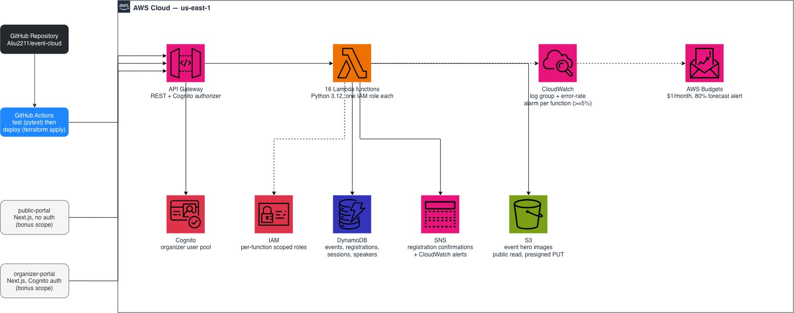
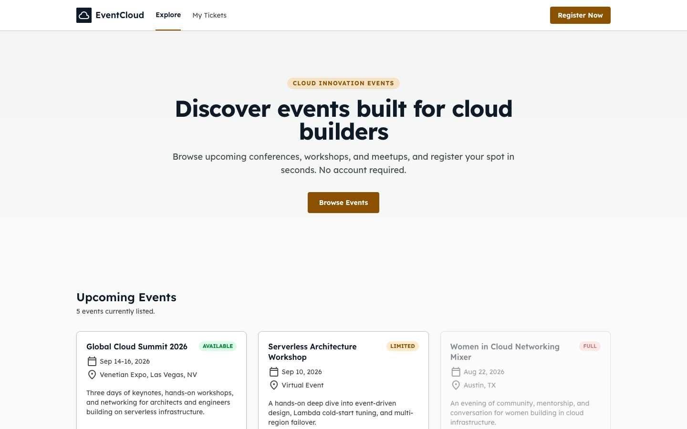
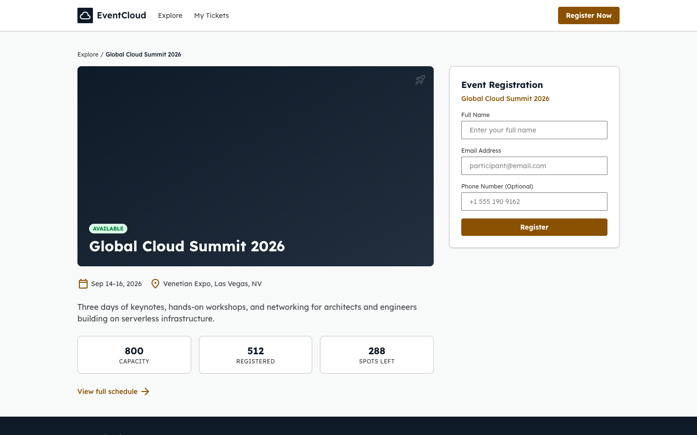
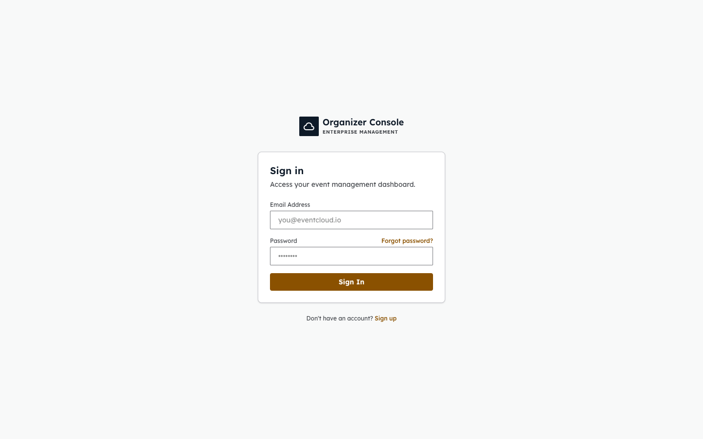

# Event Registration and Ticketing System

A serverless REST API on AWS that replaces Microsoft Forms + Excel for event registration — built for the getINNOtized x Azubi Africa Capstone.

**Live frontends** (Vercel):
- Public portal — https://public-portal-seven.vercel.app (runs on mock data; works standalone)
- Organizer console — https://organizer-portal-five.vercel.app (needs a live API + Cognito to actually load data or sign in — see note below)

**Live API**: torn down between work sessions to stay inside the Free Tier and avoid idle cost — see [Running it yourself](#running-it-yourself) to redeploy. `terraform apply` reprovisions the whole backend in one command; `terraform destroy` tears it back down.

## The problem

Manual event registration via forms and spreadsheets doesn't scale: no real-time capacity tracking, no automated confirmations, no audit trail, and no way to query registrations by event or by attendee without opening a spreadsheet. This system replaces that with a REST API backed by managed AWS services, so registration state, capacity, and confirmations are all handled automatically.

## Architecture



GitHub push triggers GitHub Actions, which runs the test suite then `terraform apply`s the whole stack. API Gateway fronts 16 Lambda functions, each with its own least-privilege IAM role; they read/write DynamoDB, authenticate organizers via Cognito, publish registration confirmations and CloudWatch alerts via SNS, and store event images in S3. CloudWatch tracks logs and per-function error-rate alarms; AWS Budgets watches spend. Editable source: `architecture.drawio` (open at [app.diagrams.net](https://app.diagrams.net)).

Every function has its own IAM role scoped to only the table actions it actually performs (least privilege) — see `infrastructure/modules/lambda/main.tf`.

## Screenshots

Live captures from the deployed frontends (not mockups):

| Public portal — event list | Public portal — event + registration |
|---|---|
|  |  |

| Organizer console — sign in |
|---|
|  |

The public portal above is rendering its built-in mock-data fallback (no live API is configured on this deployment right now — see "Live API" note up top). The organizer console needs a live API + Cognito pool to get past this screen; it's shown here to demonstrate the UI, not a working session.

## Notes: decisions and things that broke

A condensed version of the fuller write-up in [`WALKTHROUGH.md`](WALKTHROUGH.md):

- **DynamoDB rejects empty strings as GSI key values.** A session with no assigned speaker can't have `speaker_id: ""` on the `speaker-index` GSI — every write failed until the attribute was omitted entirely instead of defaulted to empty.
- **`json.dumps` doesn't know what to do with DynamoDB's `Decimal` type.** Every handler carries a small custom encoder that converts whole numbers to `int` and fractional ones to `float`.
- **API Gateway won't answer CORS preflight on its own.** Lambda proxy integrations only handle the HTTP method they're bound to; every browser-facing resource needed an explicit `OPTIONS` method backed by a `MOCK` integration.
- **Two path parameters can't share one API Gateway resource.** The spec's literal `GET /registrations/{email}` collides with the already-shipped `GET /registrations/{registration_id}` — API Gateway resolves one path-parameter name per position. Resolved by making `registration_get` sniff the path segment for `@` instead of adding a second, conflicting resource.
- **Cognito's app client only allows `USER_PASSWORD_AUTH`; the Amplify SDK defaults to SRP.** Login failed silently until the sign-in call explicitly requested the enabled flow — caught only by testing an actual browser login, not by any automated test.
- **Retrofitting least-privilege IAM meant a full stack teardown and redeploy**, not an in-place patch: moving 16 functions from one shared role to one scoped role each changes every function's role binding at once.
- **CloudWatch alarms needed to be a rate, not a count.** "5 errors in 5 minutes" means something different at 10 requests a day versus 10,000; a metric-math expression (`errors ÷ invocations × 100`) turns the alarm into an actual percentage.
- **CI's pinned Terraform 1.6.0 started failing provider signature checks it used to pass** (`openpgp: key expired`) — a ~2023-era CLI eventually stops trusting a provider release signed with a since-rotated HashiCorp key. Fixed by bumping the pinned CLI version to match what's used locally.

## API endpoints

Public endpoints need no auth. Organizer endpoints require a Cognito ID token (`Authorization: <token>` header) from a user in the `organizers` pool.

| Method | Path | Auth | Description |
|---|---|---|---|
| `POST` | `/events` | organizer | Create an event |
| `GET` | `/events` | public | List events (optional `?status=`) |
| `GET` | `/events/{event_id}` | public | Get one event |
| `POST` | `/events/{event_id}/register` | public | Register for an event |
| `POST` | `/register` | public | Same as above, `event_id` in the body (flat alias) |
| `GET` | `/events/{event_id}/registrations` | organizer | List registrations for one event |
| `GET` | `/registrations` | organizer | List every registration, all events |
| `GET` | `/registrations/{registration_id}` | public | Get one registration by ID |
| `GET` | `/registrations/{email}` | public | Same route: an `@` in the path segment is treated as an email and returns every registration for it |
| `GET` | `/registrations/lookup?email=` | public | Email lookup via query param |
| `DELETE` | `/registrations/{registration_id}` | public | Cancel a registration (soft delete: status → `cancelled`, frees up a capacity slot) |
| `POST` | `/events/{event_id}/sessions` | organizer | Add a session to an event |
| `GET` | `/events/{event_id}/sessions` | public | List an event's sessions |
| `POST` | `/speakers` | organizer | Add a speaker |
| `GET` | `/speakers` | public | List speakers |
| `GET` | `/speakers/{speaker_id}` | public | Get one speaker |
| `GET` | `/speakers/{speaker_id}/sessions` | public | A speaker's sessions across every event |
| `POST` | `/uploads/image-url` | organizer | Get a presigned S3 URL to upload an event hero image |

## Structure

```
functions/          16 Lambda handlers, one directory each (handler.py + requirements.txt)
infrastructure/      Terraform: dynamodb, lambda, api_gateway, cloudwatch, sns, s3_images modules
tests/                pytest + moto test suite (39 tests, one per handler behavior)
scripts/              Lambda packaging script
.github/workflows/    CI: pytest on every push/PR, Terraform deploy on push to main
public-portal/        Attendee-facing Next.js app, no auth (optional bonus scope)
organizer-portal/     Organizer-facing Next.js app, Cognito auth (optional bonus scope)
```

The two `*-portal` apps aren't part of the graded API deliverable — the spec's own "final outcome" is a single simple page. They were built as additional scope to explore the full stack end to end.

## Running it yourself

### Backend

```bash
python3 -m venv .venv && .venv/bin/pip install boto3 moto pytest
.venv/bin/pytest tests/ -v                     # 39 tests, no AWS account needed (moto-mocked)

# Deploy (needs an AWS account + a pre-created S3 bucket and DynamoDB table for
# Terraform state — see infrastructure/backend.tf for the exact names)
bash scripts/package_lambdas.sh
cd infrastructure
terraform init
terraform apply
```

### CI/CD

`.github/workflows/deploy.yml` runs `pytest` on every push and pull request to `main`. Deploying additionally needs these repository secrets: `AWS_ACCESS_KEY_ID`, `AWS_SECRET_ACCESS_KEY`, `TF_STATE_BUCKET`.

### Frontends (optional)

```bash
cd public-portal && npm install && npm run dev      # attendee portal
cd organizer-portal && npm install && npm run dev   # organizer console (needs Cognito env vars, see .env.local)
```

## Monitoring

Every Lambda has its own CloudWatch log group (14-day retention) and an alarm that fires when its **error rate** (errors ÷ invocations over a 5-minute window) reaches 5%, notifying an SNS topic subscribed by email. A separate SNS topic sends a confirmation notification on every successful registration. An AWS Budget alerts at 80% of a $1/month threshold to stay inside the Free Tier.

## Stack

AWS Lambda (Python 3.12) · API Gateway (REST) · DynamoDB · Cognito · CloudWatch · SNS · S3 · AWS Budgets · Terraform · GitHub Actions · pytest/moto · Next.js
